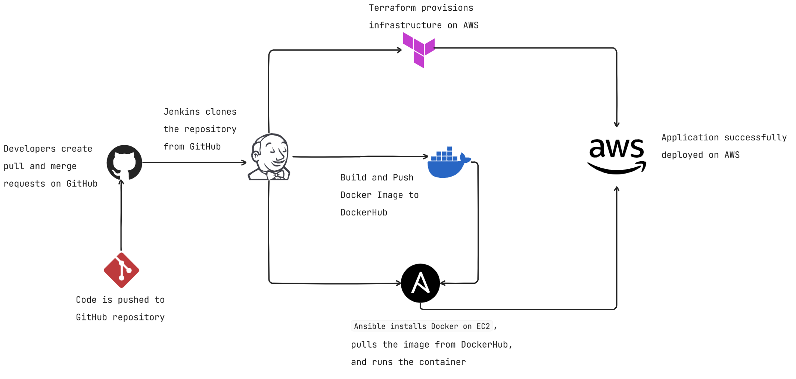

# 📄 DevOps Case Study - Final Report

This report documents the implementation of a fully automated DevOps CI/CD pipeline used to deploy a Node.js web application on AWS using Docker, Terraform, Ansible, Jenkins, Git and GitHub.

---

## 🔗 GitHub Repository

🔗 **Repository URL**: [https://github.com/rahulbhatia3422/devops-nodejs-app](https://github.com/rahulbhatia3422/devops-nodejs-app)  
📌 Branch Used: `develop`  
🛠️ All scripts, configs, Terraform files, and Jenkinsfile are included.

---

## 1️⃣ Architecture Diagram

[Click here to view the architecture diagram](assets/architecture_diagram.png)



**Flow Summary:**
- Code is pushed to GitHub → Pull/Merge Requests are created
- Jenkins clones the repository → Builds Docker image
- Image is pushed to DockerHub
- Terraform provisions infrastructure on AWS
- Ansible installs Docker on EC2, pulls image from DockerHub, and runs the container
- The Node.js app is deployed and accessible on AWS

---

## 2️⃣ Branching Strategy

### Strategy Followed:
- `main`: Protected branch, for production-ready code only
- `develop`: All development happens here, integrated via PRs

### GitHub Protection:
- Pull requests are enforced for merging into `main`
- Review-based merges demonstrate GitHub collaboration and control

---

## 3️⃣ Terraform Resource Summary

**Terraform Modules (in `infra/` folder):**

| Component         | Description                                      |
|------------------|--------------------------------------------------|
| **VPC**          | Custom VPC with a public subnet                  |
| **EC2 Instance** | One `t2.micro` instance (Free Tier)              |
| **Elastic IP**   | Static IP associated with EC2 for public access |
| **Security Group** | Inbound: SSH (22), HTTP (80)                    |

### Commands Used:
```bash
cd infra
terraform init
terraform apply -auto-approve

---

## 4️⃣ Pipeline Execution (Jenkins)

- Jenkins was used to automate the CI/CD process.
- [View Jenkinsfile here](link)
- Stages: checkout, build, terraform, deploy
- Screenshot:


